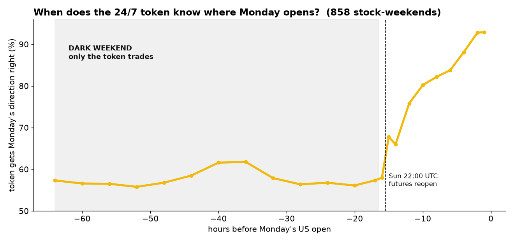
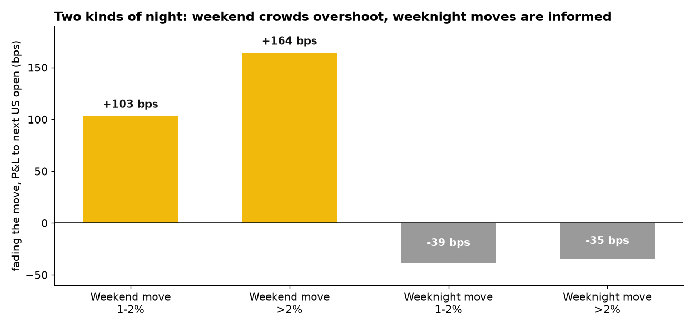
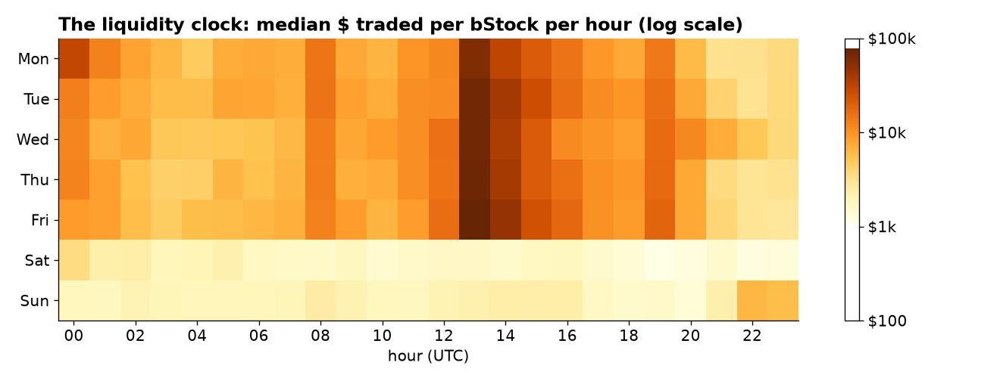

# Modulus

**Wall Street is closed 65 hours a week. bStocks aren't. Modulus is the AI that learned what that market knows, trades it, and seals its Monday forecast on-chain before the bell.**

> **10-second version:** On weekends only the token trades, on 10× thinner books. The crowd gets Monday's
> *direction* right but its *size* wrong, it overshoots ~2×. Modulus' Council of Elders buys the weekend panic,
> trims the euphoria, and commits a Merkle-sealed forecast of Monday's open to BNB Chain that reality grades at 9:30 ET.

**At a glance**
- **What it is** — an autonomous agent that trades tokenized US stocks (bStocks) on BNB Chain, with a Council of Elders voting every verdict.
- **The edge** — on weekends only the token trades, on ~10× thinner books; the crowd overshoots Monday's move ~2×, so Modulus fades the weekend panic (66.5% win, +103 bps on 1–2% moves).
- **On-chain proof** — every Sunday it Merkle-seals a forecast of Monday's open to [`WeekendOracle.sol`](contracts/WeekendOracle.sol) on BSC, then reveals and self-grades (hit rate, Brier); a track record nobody can edit.
- **Runs read-only, no keys** — `python -m modulus scan` runs the live council on all 87 bStocks from public data; simulate/dry-run is the default and live trades are capped at $5/trade, $20/day.
- **Live on mainnet** — first real execution: **BOUGHT 0.05453 SOXSB for $1.68** at 63% council confidence. Tx [`0x9ff3ef…ca449a`](https://bsctrace.com/tx/0x9ff3ef4e5d87446aec519e6c12dde64e97a5d9890d2f3f0bbf7545b9e2ca449a) on BSC — see [`docs/LIVE_TRADE.md`](docs/LIVE_TRADE.md).
- **Live dashboard** — https://dashboard-zeta-hazel-llhp56jb66.vercel.app (council + Monday Oracle results, no keys needed).
- **On-chain, deployed** — [`WeekendOracle.sol`](contracts/WeekendOracle.sol) live on BSC mainnet at [`0xEebDda24…E71dB2`](https://bsctrace.com/address/0xEebDda242F73f3ed7c1d002aD2d8d2055eE71dB2) (`enforceWindow=true`), deployed in tx [`0xb36899…33735d`](https://bsctrace.com/tx/0xb36899524c3db23dd180700d4ad96dc38c11e4a983e4cd0566f9d93a0133735d).



## The finding (858 stock-weekends, 17 weekends, all 87 bStocks)

Full write-up: [`research/FINDINGS.md`](research/FINDINGS.md). Data: Binance Spot 1h (24/7) + the real US share.

| | |
|---|---|
| Weekend share of hours / of volume | **30% / 8%** (Saturday $1.6k vs $16.4k per bStock-hour) |
| Market-wide weekend move calls Monday's direction | **13 of 17 weekends** |
| Real Monday gap ÷ token's stock-specific weekend move | **0.52×**, the crowd overshoots |
| Fade a 1–2% weekend move (Sun 21:00 UTC → Mon open) | **66.5% win, +103 bps** (n=176) |
| Fade a >2% weekend move | **64.7% win, +164 bps** (n=85), 13/14 weekends positive |
| Same fade on *weeknights* | **−40 bps**: weeknight moves are informed |
| Monday Oracle, out-of-sample, calls ≥1% | **72.1% right, Brier 0.223** (n=262) |

**Two kinds of night.** When futures and Asia trade, token moves carry information. When nothing else prices US
stocks (Fri 20:00 → Sun 22:00 UTC), they carry emotion. Modulus knows which night it is.



**We were wrong first.** v1 claimed weekend drift *continues* (59.8%, 4 weekends of DEX prints). Seventeen
weekends of order-book data overturned that. The old study stays in `research/weekend_study.py`. The
calibration layer is why an agent can be wrong in public and still be trusted.

## The Monday Oracle (on-chain, can't be faked)

Every weekend, before 22:00 UTC Sunday, Modulus forecasts P(up) and the expected gap for every bStock, builds a
**Merkle tree**, and commits `sha256(root‖salt)` to [`contracts/WeekendOracle.sol`](contracts/WeekendOracle.sol) on BSC.
After Monday's open it reveals the root. Anyone can prove any single forecast, and the contract stores the grade
(hit rate, Brier). A track record nobody, us included, can edit.

```
python -m modulus oracle forecast | commit | reveal --week 2026-10-09 | grade --week 2026-10-09 | backtest
```

## The Two Nights clock (how it trades)

`python -m modulus clock` → regime (`dark_weekend`, `dawn`, `weeknight`, `regular`), depth factor from the
liquidity clock, **limit orders only** in thin hours, clip size × √depth, tighter slippage (0.5%) on weekends.



## The Council of Elders

| Elder | What it watches | Data |
|---|---|---|
| **The Night Watchman** (gap) | Knows which night it is. Dark weekend: **fades** stock-specific moves >1% (66% win). Weeknight: leans with them. | Binance Spot 24/7 klines + Two Nights clock |
| **The Whale Watcher** (whale) | Spot taker-buy aggressor share since the close, on-chain buy vs sell flow 1h/4h/24h, smart-money and KOL holding share, Binance-wallet avg cost vs price, top-10 concentration, tracked smart-money trades | token dynamic, wallet-skills `binance-wallet-tracker` / `binance-leaderboard` / `binance-trading-signal` |
| **The Arbiter** | The same company as **bStock vs Ondo vs xStocks**, per share (price / sharesMultiplier). Flags >15% gaps as broken feeds, not free money. | RWA Data API (3 platforms) |
| **The Value Elder** | 52-week range position, P/E (ROE used as an optional quality gate when present) | RWA underlying-market / stockInfo |
| **The Sentinel** | **Veto only.** Corporate actions (dividend, split, merger), earnings limits, paused markets, stale prices, oracle sanity, token audit (fail-closed) | RWA status, `query-token-audit` |

**How the council decides** ([`council.py`](modulus/council.py))
1. Any Sentinel veto ends it: **VETO**.
2. Votes pool in log-odds, weighted by prior weight × each elder's **earned Brier skill**.
3. **Dissent** (the weight that disagrees) shrinks confidence.
4. **Quorum**: two elders must agree. No trade on one voice.
5. **Calibration** ([`calibration.py`](modulus/calibration.py)): isotonic map from raw to calibrated
   probability, shrunk toward 0.5, capped at 80%. It's seeded with 259 historical dark-weekend signals (claimed 65.9%, observed 65.6%, Brier 0.2255, ECE 0.28%) and refit on every resolved verdict.
   Brier score, ECE and the reliability table are public (`python -m modulus calibration`, MCP tool `modulus_calibration`).
6. **Sizing** ([`sizing.py`](modulus/sizing.py)): quarter-Kelly on the calibrated probability × (1 − dissent),
   then $5 per trade, $20 per day (resting limit orders included) and 20% per ticker caps. Modulus' own $5/$20/20% caps are the binding guardrail; per the campaign rules an eligible bStock only skips the wallet's `query-token-audit` pre-check, while the Agentic Wallet `dailyLimit` still applies to spend.

Every verdict lands in SQLite with each elder's vote. The next session scores it, and the scores
feed back into calibration and elder weights. That makes Modulus a **self-auditing** agent.

## Stack coverage

| Hackathon component | How Modulus uses it | Where |
|---|---|---|
| RWA Data API | 3-platform universe (bStocks + Ondo + xStocks), per-share price, status / next open, profile + attestations, sector tabs | `clients/binance_web3.py`, `universe.py` |
| Market API | candles, price-info, holders, top traders, top liquidity, trades, address tracker | `binance_web3.py`, Whale Watcher |
| Trading API | quote (bStocks return a LiquidMesh SWAP **and** a PcsXRfq RFQ route; best net-out, firm RFQ preferred within 10 bps), on-chain allowance check, approve only when short + re-quote (30 s quote TTL), swap with `priceImpactProtectionPercent`, RFQ EIP-712 submit + poll to FILLED/FAILED/EXPIRED/CANCELLED, 40369 market-closed → DEFERRED | `executor.py` |
| Transaction API | **simulate** (`evmTx{from,to,value,data}`) before every raw swap, gas limit, broadcast with MEV protection, tx-detail polling | `executor.py` (dry-run is the default) |
| Wallet API / Address Portfolio | balances, tx detail polling, per-token PnL | `binance_web3.py`, ledger resolve |
| DeFi API | idle-USDT parking functions (investment list / deposit calldata) — library-level, not yet wired into the autonomous loop | `binance_web3.py` |
| b402 Payments | x402 **V2** paid `/verdict/{ticker}`: 402 + `PAYMENT-REQUIRED` → `PAYMENT-SIGNATURE` → B402 `verify` → council runs → `settle` → `PAYMENT-RESPONSE`; offers U / USD1 (EIP-3009) and USDT (Permit2) copied from `/supported`; Bazaar metadata for discovery | `server/x402_api.py` |
| **Agentic Wallet / Wallet Skills** | `baw` CLI subcommands — preflight (`cli-check`, `wallet status`, `settings`), `tx-lock`, `market-order` quote/swap/poll, **`limit-order` buy/sell for thin weekend books** (+ reconcile/cancel at the US open), `x402-payment preview/sign`, `defi`. Separate wallet-skills (not `baw` subcommands): `binance-wallet-tracker`, `binance-leaderboard`, `binance-trading-signal`, `query-token-audit`, `binance-tokenized-securities-info` | `clients/baw.py`, executor `baw` mode |
| **BNB Agent Studio** | Seller scaffold (studio-cli 0.0.14): ERC-8004 identity, ERC-8183 negotiate/notify_funded jobs, X402 face via B402; Modulus plugs in through the `RunWork` hook in `modulusWork.ts` | `agent-studio/` |
| MCP | 7 tools (verdict, scan, twins, calibration, market clock, Monday Oracle, Two Nights) so any agent can ask the council. (Binance's own Web3 MCP server is still "coming soon"; Modulus ships its own.) | `server/mcp_server.py` |
| BSC smart contract | `WeekendOracle.sol`: commit-reveal of Monday forecasts, window enforced on-chain, Merkle proofs, one-shot grade. One-command deploy, no Foundry needed: `cd contracts && PRIVATE_KEY=0x… node deploy.mjs --network testnet\|mainnet` | `contracts/` |
| BNB Chain | PancakeSwap / BSC tokenized-equity liquidity via the aggregator | executor |

## Run it (60 seconds, no keys)

```bash
git clone <repo> && cd modulus
python -m modulus scan                 # live council on all 87 bStocks, read-only public data
python -m modulus explain NVDA         # every elder's reasoning
python -m modulus calibration          # Brier, ECE, reliability table
python -m pytest -q                    # 50 offline tests (docs-compliance, executor, x402, MCP)
cd contracts && npm install && npm test   # 20 EVM tests: compile, commit-reveal, Python Merkle proofs on-chain
```

With keys (`cp .env.example .env`):

```bash
MODULUS_EXECUTOR=dryrun python -m modulus run   # quote -> build -> Transaction API simulate
MODULUS_EXECUTOR=baw    python -m modulus run   # live, small, via Agentic Wallet (MEV on)
python -m modulus daemon                        # session-aware loop: 15 min near the open, hourly otherwise
python -m modulus.server.mcp_server             # MCP
uvicorn modulus.server.x402_api:app --port 8402 # paid verdicts
```

## Safety by design
* Simulates before it executes, and dry-run is the default. Live trades are capped at $5 each and $20 a day.
* Fail-closed: if the audit is unreachable, a feed is stale, prices diverge or the market is paused, it does nothing.
* Conditional orders are never silently turned into market orders (Agentic Wallet skill rule); a live run never silently falls back to paper trading.
* CLI and API errors are relayed verbatim. On-chain token names are treated as untrusted (prompt-injection defense).
* Not investment advice. Tokenized securities can be halted and carry slippage and contract risk.

## Repo map
```
modulus/            agent, council, calibration, sizing, ledger, executor
modulus/elders/     gap, whale, arbiter, value, sentinel
modulus/clients/    binance_web3 (signed, all modules), public_bapi (keyless), baw (Agentic Wallet)
modulus/server/     mcp_server, x402_api (+ internal core for Agent Studio)
agent-studio/       Studio prompt + modulusWork.ts (RunWork hook)
contracts/          WeekendOracle.sol, deploy.mjs (ethers, no Foundry) + foundry.toml at repo root
research/           FINDINGS.md, 24/7 Spot study scripts, charts, v1 weekend_study.py
docs/               DX report draft, demo script, submission checklist
```
Apache-2.0 licensed.
